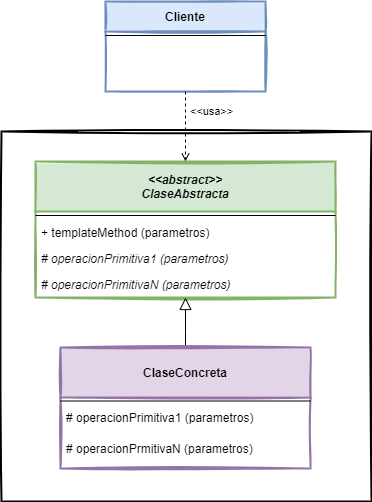

# Template Method

## 👋 Bienvenid@s

Este repositorio contiene los ejemplos de código de la implementación del patrón de diseño [*Template Method*](https://www.javatutoriales.com/2022/01/patron-de-diseno-template-method.html).

Para ver el tutorial completo, con la explicación detallada del patrón, entra al Blog:
[JavaTutoriales](https://www.javatutoriales.com/2022/01/patron-de-diseno-template-method.html)

En el tutorial doy una explicación y muestro la implementación del patrón.

Aquí dejo un breve (muy breve) resumen del mismo.

## 🎯 Objetivo de *Template Method*

- Definir el esqueleto de un algoritmo en una operación (o método) y delegar algunos de los pasos a las subclases.
- Permitir a las subclases redefinir ciertos pasos del algoritmo sin darles la opción de cambiar la estructura del algoritmo.

## 📑 Diagrama

## ⚙️ Requerimientos
El proyecto está desarrollado usando **Java 17** y **Gradle 7.3**, uso lambdas en parte del código, por lo que es necesario que uses cualquier versión arriba de Java 8.

## 💻 Explicación
Para ver el tutorial completo, con la explicación detallada del patrón, entra al Blog:
[JavaTutoriales](https://www.javatutoriales.com/2022/01/patron-de-diseno-template-method.html)